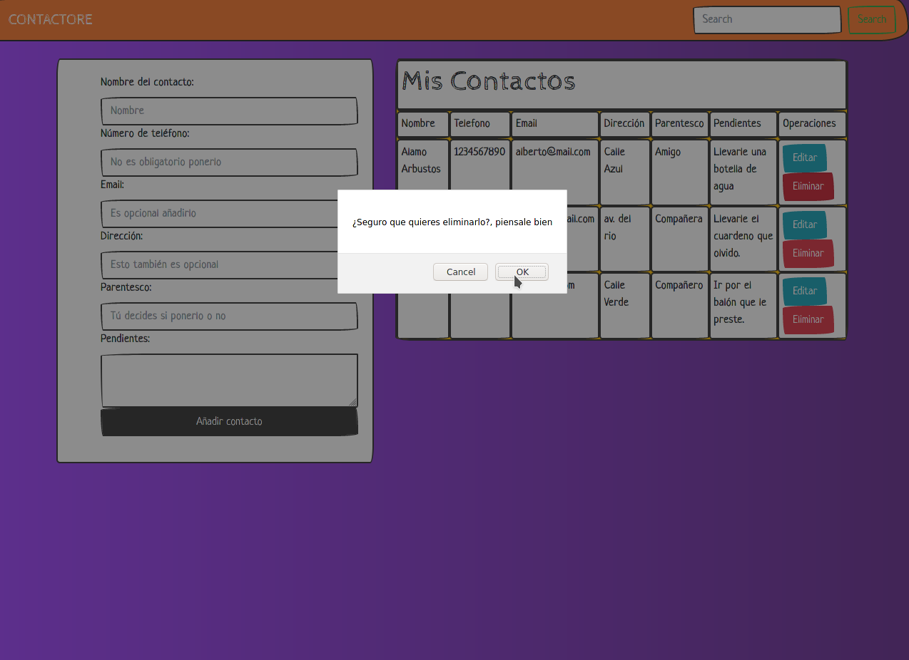

# Contactore
A web application for store contacts and write pendings for each contact, using python3 through its web framework Flask and using Mysql as database to store data.

You can add contacts.

Edit contacts.

  

Search contacts.

  

And delete contacts.

  
